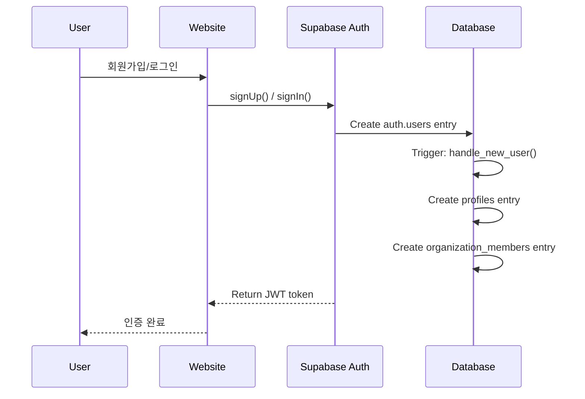
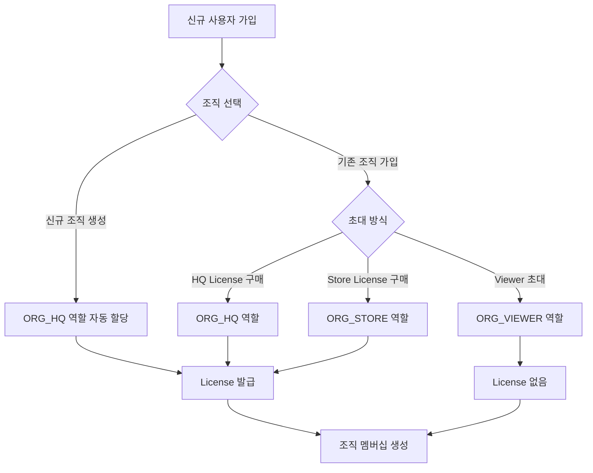
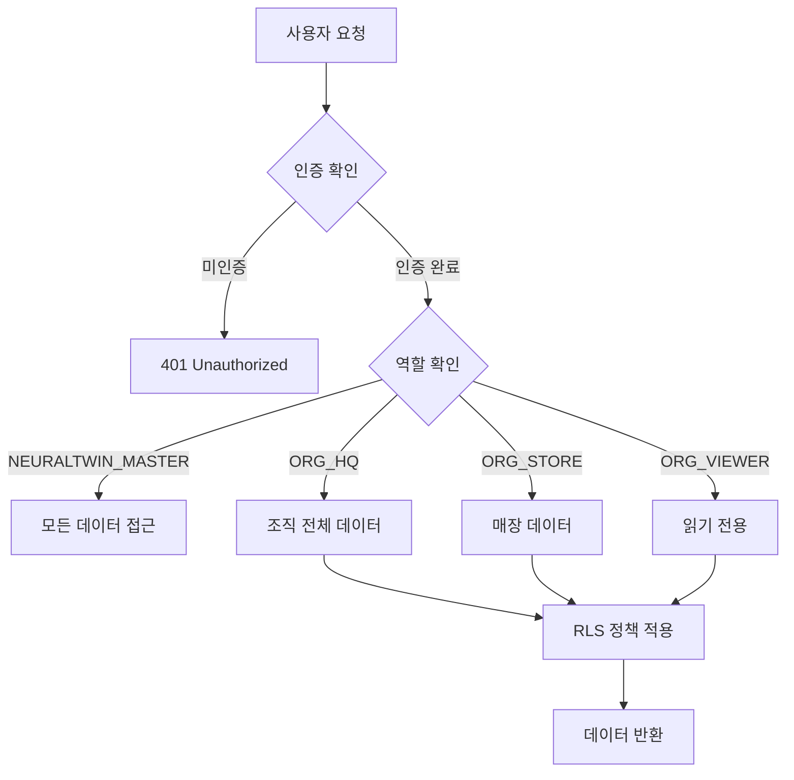
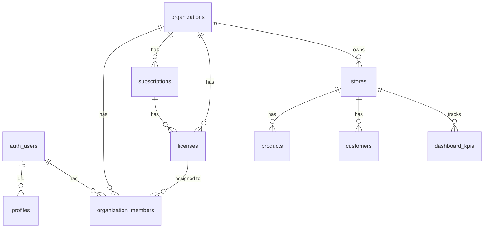

# NEURALTWIN 백엔드/데이터베이스 구조 정의서

## 📋 문서 개요

**프로젝트**: NEURALTWIN 플랫폼  
**버전**: 1.0  
**작성일**: 2025-01-25  
**적용 범위**: 웹사이트, 고객 대시보드, 관리자 대시보드 공통

---

## 1. 시스템 아키텍처

### 1.1 백엔드 스택
- **Database**: Supabase (PostgreSQL 13+)
- **Authentication**: Supabase Auth
- **Storage**: Supabase Storage
- **Serverless Functions**: Supabase Edge Functions (Deno)
- **Real-time**: Supabase Realtime (WebSocket)

### 1.2 프로젝트 정보
- **Project ID**: `bdrvowacecxnraaivlhr`
- **Project URL**: `https://bdrvowacecxnraaivlhr.supabase.co`
- **API Endpoint**: `https://bdrvowacecxnraaivlhr.supabase.co/rest/v1/`

---

## 2. 데이터베이스 스키마

### 2.1 핵심 테이블 구조

#### 2.1.1 사용자 및 조직 관리

##### `profiles`
사용자 프로필 정보 (auth.users 확장)

| 컬럼명 | 타입 | 제약조건 | 설명 |
|--------|------|----------|------|
| id | UUID | PK, FK → auth.users(id) | 사용자 ID |
| display_name | TEXT | NULLABLE | 표시 이름 |
| avatar_url | TEXT | NULLABLE | 프로필 이미지 URL |
| created_at | TIMESTAMPTZ | NOT NULL, DEFAULT now() | 생성일 |
| updated_at | TIMESTAMPTZ | NOT NULL, DEFAULT now() | 수정일 |

**트리거**: `handle_new_user()` - auth.users에 신규 사용자 생성 시 자동 프로필 생성

---

##### `organizations`
고객 조직 정보

| 컬럼명 | 타입 | 제약조건 | 설명 |
|--------|------|----------|------|
| id | UUID | PK, DEFAULT gen_random_uuid() | 조직 ID |
| org_name | TEXT | NOT NULL | 조직명 |
| created_by | UUID | NULLABLE, FK → auth.users(id) | 생성자 |
| member_count | INTEGER | NULLABLE, DEFAULT 0 | 멤버 수 (자동 계산) |
| metadata | JSONB | NULLABLE, DEFAULT '{}' | 추가 메타데이터 |
| created_at | TIMESTAMPTZ | NOT NULL, DEFAULT now() | 생성일 |
| updated_at | TIMESTAMPTZ | NOT NULL, DEFAULT now() | 수정일 |

**트리거**: `update_org_member_count()` - organization_members 변경 시 member_count 자동 업데이트

---

##### `organization_members`
조직 멤버십 및 역할 관리

| 컬럼명 | 타입 | 제약조건 | 설명 |
|--------|------|----------|------|
| id | UUID | PK, DEFAULT gen_random_uuid() | 멤버십 ID |
| user_id | UUID | NOT NULL, FK → auth.users(id) | 사용자 ID |
| org_id | UUID | NULLABLE, FK → organizations(id) | 조직 ID |
| role | app_role | NOT NULL, DEFAULT 'ORG_VIEWER' | 역할 (ENUM) |
| license_id | UUID | NULLABLE, FK → licenses(id) | 라이선스 ID |
| invited_by | UUID | NULLABLE, FK → auth.users(id) | 초대자 |
| permissions | JSONB | NULLABLE | 세부 권한 |
| joined_at | TIMESTAMPTZ | NOT NULL, DEFAULT now() | 가입일 |
| invitation_accepted_at | TIMESTAMPTZ | NULLABLE | 초대 수락일 |
| created_at | TIMESTAMPTZ | NOT NULL, DEFAULT now() | 생성일 |
| updated_at | TIMESTAMPTZ | NOT NULL, DEFAULT now() | 수정일 |

**ENUM**: `app_role`
```sql
CREATE TYPE app_role AS ENUM (
  'NEURALTWIN_MASTER',  -- 시스템 관리자
  'ORG_HQ',             -- 본사 관리자
  'ORG_STORE',          -- 매장 관리자
  'ORG_ADMIN',          -- 조직 관리자 (deprecated)
  'ORG_VIEWER'          -- 읽기 전용
);
```

**트리거**: `update_viewer_count()` - ORG_VIEWER 역할 변경 시 구독의 viewer_count 업데이트

**UNIQUE 제약**: `(user_id, org_id)` - 한 사용자는 조직당 하나의 역할만 가능

---

#### 2.1.2 구독 및 라이선스 관리

##### `subscriptions`
조직별 구독 정보

| 컬럼명 | 타입 | 제약조건 | 설명 |
|--------|------|----------|------|
| id | UUID | PK, DEFAULT gen_random_uuid() | 구독 ID |
| org_id | UUID | NOT NULL, FK → organizations(id) | 조직 ID |
| plan_type | TEXT | NULLABLE | 플랜 타입 (legacy) |
| status | TEXT | NOT NULL, DEFAULT 'active' | 상태 (active/suspended/cancelled) |
| hq_license_count | INTEGER | NOT NULL, DEFAULT 0 | HQ 라이선스 수 |
| store_license_count | INTEGER | NOT NULL, DEFAULT 0 | Store 라이선스 수 |
| viewer_count | INTEGER | NOT NULL, DEFAULT 0 | Viewer 수 |
| monthly_cost | NUMERIC | NOT NULL, DEFAULT 0 | 월 비용 (자동 계산) |
| start_date | DATE | NOT NULL | 시작일 |
| end_date | DATE | NULLABLE | 종료일 |
| next_billing_date | DATE | NULLABLE | 다음 청구일 |
| billing_cycle | TEXT | NOT NULL, DEFAULT 'monthly' | 청구 주기 |
| metadata | JSONB | NULLABLE, DEFAULT '{}' | 추가 메타데이터 |
| created_at | TIMESTAMPTZ | NOT NULL, DEFAULT now() | 생성일 |
| updated_at | TIMESTAMPTZ | NOT NULL, DEFAULT now() | 수정일 |

**자동 계산**: `monthly_cost = (hq_license_count × $500) + (store_license_count × $250)`

**트리거**: `update_license_counts()` - licenses 테이블 변경 시 자동 업데이트

---

##### `licenses`
개별 라이선스 관리

| 컬럼명 | 타입 | 제약조건 | 설명 |
|--------|------|----------|------|
| id | UUID | PK, DEFAULT gen_random_uuid() | 라이선스 ID |
| org_id | UUID | NOT NULL, FK → organizations(id) | 조직 ID |
| subscription_id | UUID | NULLABLE, FK → subscriptions(id) | 구독 ID |
| license_type | TEXT | NOT NULL | 라이선스 타입 (HQ_SEAT/STORE) |
| license_key | TEXT | NULLABLE, UNIQUE | 라이선스 키 |
| status | TEXT | NOT NULL, DEFAULT 'active' | 상태 (active/assigned/revoked/expired) |
| assigned_to | UUID | NULLABLE, FK → auth.users(id) | 할당된 사용자 |
| assigned_store_id | UUID | NULLABLE, FK → stores(id) | 할당된 매장 |
| monthly_price | NUMERIC | NULLABLE | 월 가격 |
| effective_date | DATE | NOT NULL | 유효 시작일 |
| expiry_date | DATE | NULLABLE | 만료일 |
| issued_at | TIMESTAMPTZ | NULLABLE, DEFAULT now() | 발급일 |
| activated_at | TIMESTAMPTZ | NULLABLE | 활성화일 |
| last_used_at | TIMESTAMPTZ | NULLABLE | 최근 사용일 |
| next_billing_date | DATE | NULLABLE | 다음 청구일 |
| billing_history | JSONB | NULLABLE, DEFAULT '[]' | 청구 이력 |
| metadata | JSONB | NULLABLE, DEFAULT '{}' | 추가 메타데이터 |
| created_at | TIMESTAMPTZ | NOT NULL, DEFAULT now() | 생성일 |
| updated_at | TIMESTAMPTZ | NOT NULL, DEFAULT now() | 수정일 |

**트리거**: `update_license_counts()` - 라이선스 추가/삭제/변경 시 subscriptions 테이블 업데이트

---

##### `invitations`
초대 관리 (Viewer 초대용)

| 컬럼명 | 타입 | 제약조건 | 설명 |
|--------|------|----------|------|
| id | UUID | PK, DEFAULT gen_random_uuid() | 초대 ID |
| org_id | UUID | NOT NULL, FK → organizations(id) | 조직 ID |
| email | TEXT | NOT NULL | 초대 이메일 |
| token | TEXT | NOT NULL, UNIQUE | 초대 토큰 |
| role | app_role | NOT NULL | 역할 (주로 ORG_VIEWER) |
| invited_by | UUID | NOT NULL, FK → auth.users(id) | 초대자 |
| license_id | UUID | NULLABLE, FK → licenses(id) | 라이선스 ID (선택) |
| status | TEXT | NOT NULL, DEFAULT 'pending' | 상태 (pending/accepted/expired) |
| expires_at | TIMESTAMPTZ | NOT NULL | 만료일 (7일) |
| accepted_at | TIMESTAMPTZ | NULLABLE | 수락일 |
| metadata | JSONB | NULLABLE, DEFAULT '{}' | 추가 메타데이터 |
| created_at | TIMESTAMPTZ | NOT NULL, DEFAULT now() | 생성일 |
| updated_at | TIMESTAMPTZ | NOT NULL, DEFAULT now() | 수정일 |

---

#### 2.1.3 매장 및 운영 데이터

##### `stores`
매장 정보

| 컬럼명 | 타입 | 제약조건 | 설명 |
|--------|------|----------|------|
| id | UUID | PK, DEFAULT gen_random_uuid() | 매장 ID |
| user_id | UUID | NOT NULL, FK → auth.users(id) | 소유자 ID |
| org_id | UUID | NULLABLE, FK → organizations(id) | 조직 ID |
| store_name | TEXT | NOT NULL | 매장명 |
| address | TEXT | NULLABLE | 주소 |
| location | GEOMETRY(Point, 4326) | NULLABLE | 위치 (위경도) |
| store_type | TEXT | NULLABLE | 매장 유형 |
| area_sqm | NUMERIC | NULLABLE | 면적 (제곱미터) |
| opening_hours | JSONB | NULLABLE | 운영 시간 |
| status | TEXT | NOT NULL, DEFAULT 'active' | 상태 |
| metadata | JSONB | NULLABLE, DEFAULT '{}' | 추가 메타데이터 |
| created_at | TIMESTAMPTZ | NOT NULL, DEFAULT now() | 생성일 |
| updated_at | TIMESTAMPTZ | NOT NULL, DEFAULT now() | 수정일 |

---

##### `products`
제품 정보

| 컬럼명 | 타입 | 제약조건 | 설명 |
|--------|------|----------|------|
| id | UUID | PK, DEFAULT gen_random_uuid() | 제품 ID |
| user_id | UUID | NOT NULL, FK → auth.users(id) | 소유자 ID |
| org_id | UUID | NULLABLE, FK → organizations(id) | 조직 ID |
| store_id | UUID | NULLABLE, FK → stores(id) | 매장 ID |
| name | TEXT | NOT NULL | 제품명 (deprecated) |
| product_name | TEXT | NOT NULL | 제품명 |
| sku | TEXT | NULLABLE | SKU 코드 |
| category | TEXT | NULLABLE | 카테고리 |
| brand | TEXT | NULLABLE | 브랜드 |
| description | TEXT | NULLABLE | 설명 |
| price | NUMERIC | NULLABLE | 가격 (deprecated) |
| cost_price | NUMERIC | NULLABLE | 원가 |
| selling_price | NUMERIC | NULLABLE | 판매가 |
| stock | INTEGER | NULLABLE | 재고 |
| min_stock_level | INTEGER | NULLABLE | 최소 재고 수준 |
| supplier | TEXT | NULLABLE | 공급업체 |
| created_at | TIMESTAMPTZ | NOT NULL, DEFAULT now() | 생성일 |
| updated_at | TIMESTAMPTZ | NOT NULL, DEFAULT now() | 수정일 |

---

##### `customers`
고객 정보

| 컬럼명 | 타입 | 제약조건 | 설명 |
|--------|------|----------|------|
| id | UUID | PK, DEFAULT gen_random_uuid() | 고객 ID |
| user_id | UUID | NOT NULL, FK → auth.users(id) | 소유자 ID |
| org_id | UUID | NULLABLE, FK → organizations(id) | 조직 ID |
| store_id | UUID | NULLABLE, FK → stores(id) | 매장 ID |
| customer_name | TEXT | NULLABLE | 고객명 |
| email | TEXT | NULLABLE | 이메일 |
| phone | TEXT | NULLABLE | 전화번호 |
| segment | TEXT | NULLABLE | 세그먼트 (VIP/Regular/New) |
| total_purchases | NUMERIC | NULLABLE, DEFAULT 0 | 총 구매액 |
| last_visit_date | TIMESTAMPTZ | NULLABLE | 최근 방문일 |
| created_at | TIMESTAMPTZ | NOT NULL, DEFAULT now() | 생성일 |
| updated_at | TIMESTAMPTZ | NOT NULL, DEFAULT now() | 수정일 |

---

#### 2.1.4 분석 및 KPI 데이터

##### `dashboard_kpis`
대시보드 KPI 지표

| 컬럼명 | 타입 | 제약조건 | 설명 |
|--------|------|----------|------|
| id | UUID | PK, DEFAULT gen_random_uuid() | KPI ID |
| user_id | UUID | NOT NULL, FK → auth.users(id) | 소유자 ID |
| org_id | UUID | NULLABLE, FK → organizations(id) | 조직 ID |
| store_id | UUID | NULLABLE, FK → stores(id) | 매장 ID |
| date | DATE | NOT NULL | 날짜 |
| total_revenue | NUMERIC | NULLABLE, DEFAULT 0 | 총 매출 |
| total_visits | INTEGER | NULLABLE, DEFAULT 0 | 총 방문자 수 |
| total_purchases | INTEGER | NULLABLE, DEFAULT 0 | 총 구매 건수 |
| conversion_rate | NUMERIC | NULLABLE, DEFAULT 0 | 전환율 |
| sales_per_sqm | NUMERIC | NULLABLE, DEFAULT 0 | 평당 매출 |
| labor_hours | NUMERIC | NULLABLE, DEFAULT 0 | 인건비 시간 |
| funnel_entry | INTEGER | NULLABLE, DEFAULT 0 | 퍼널: 입장 |
| funnel_browse | INTEGER | NULLABLE, DEFAULT 0 | 퍼널: 브라우징 |
| funnel_fitting | INTEGER | NULLABLE, DEFAULT 0 | 퍼널: 피팅 |
| funnel_purchase | INTEGER | NULLABLE, DEFAULT 0 | 퍼널: 구매 |
| funnel_return | INTEGER | NULLABLE, DEFAULT 0 | 퍼널: 반품 |
| consumer_sentiment_index | NUMERIC | NULLABLE | 소비자 심리 지수 |
| is_holiday | BOOLEAN | NULLABLE, DEFAULT false | 공휴일 여부 |
| special_event | TEXT | NULLABLE | 특별 이벤트 |
| weather_condition | TEXT | NULLABLE | 날씨 |
| created_at | TIMESTAMPTZ | NOT NULL, DEFAULT now() | 생성일 |
| updated_at | TIMESTAMPTZ | NOT NULL, DEFAULT now() | 수정일 |

---

##### `ai_recommendations`
AI 추천 사항

| 컬럼명 | 타입 | 제약조건 | 설명 |
|--------|------|----------|------|
| id | UUID | PK, DEFAULT gen_random_uuid() | 추천 ID |
| user_id | UUID | NOT NULL, FK → auth.users(id) | 소유자 ID |
| org_id | UUID | NULLABLE, FK → organizations(id) | 조직 ID |
| store_id | UUID | NULLABLE, FK → stores(id) | 매장 ID |
| recommendation_type | TEXT | NOT NULL | 추천 타입 |
| title | TEXT | NOT NULL | 제목 |
| description | TEXT | NOT NULL | 설명 |
| priority | TEXT | NOT NULL | 우선순위 (high/medium/low) |
| status | TEXT | NULLABLE, DEFAULT 'pending' | 상태 |
| action_category | TEXT | NULLABLE | 액션 카테고리 |
| data_source | TEXT | NULLABLE | 데이터 소스 |
| evidence | JSONB | NULLABLE | 근거 데이터 |
| expected_impact | JSONB | NULLABLE | 예상 효과 |
| is_displayed | BOOLEAN | NULLABLE, DEFAULT true | 표시 여부 |
| displayed_at | TIMESTAMPTZ | NULLABLE | 표시 시작일 |
| dismissed_at | TIMESTAMPTZ | NULLABLE | 무시일 |
| created_at | TIMESTAMPTZ | NOT NULL, DEFAULT now() | 생성일 |
| updated_at | TIMESTAMPTZ | NOT NULL, DEFAULT now() | 수정일 |

---

#### 2.1.5 온톨로지 및 그래프 데이터

##### `ontology_entity_types`
온톨로지 엔티티 타입 정의

| 컬럼명 | 타입 | 제약조건 | 설명 |
|--------|------|----------|------|
| id | UUID | PK, DEFAULT gen_random_uuid() | 엔티티 타입 ID |
| user_id | UUID | NOT NULL, FK → auth.users(id) | 소유자 ID |
| org_id | UUID | NULLABLE, FK → organizations(id) | 조직 ID |
| name | TEXT | NOT NULL | 타입명 |
| label | TEXT | NOT NULL | 표시 라벨 |
| description | TEXT | NULLABLE | 설명 |
| icon | TEXT | NULLABLE | 아이콘 |
| color | TEXT | NULLABLE, DEFAULT '#3b82f6' | 색상 |
| properties | JSONB | NULLABLE, DEFAULT '[]' | 속성 정의 |
| model_3d_type | TEXT | NULLABLE | 3D 모델 타입 |
| model_3d_url | TEXT | NULLABLE | 3D 모델 URL |
| model_3d_dimensions | JSONB | NULLABLE, DEFAULT '{"width": 1, "height": 1, "depth": 1}' | 3D 모델 크기 |
| model_3d_metadata | JSONB | NULLABLE, DEFAULT '{}' | 3D 모델 메타데이터 |
| created_at | TIMESTAMPTZ | NULLABLE, DEFAULT now() | 생성일 |
| updated_at | TIMESTAMPTZ | NULLABLE, DEFAULT now() | 수정일 |

---

##### `ontology_relation_types`
온톨로지 관계 타입 정의

| 컬럼명 | 타입 | 제약조건 | 설명 |
|--------|------|----------|------|
| id | UUID | PK, DEFAULT gen_random_uuid() | 관계 타입 ID |
| user_id | UUID | NOT NULL, FK → auth.users(id) | 소유자 ID |
| org_id | UUID | NULLABLE, FK → organizations(id) | 조직 ID |
| name | TEXT | NOT NULL | 타입명 |
| label | TEXT | NOT NULL | 표시 라벨 |
| description | TEXT | NULLABLE | 설명 |
| source_entity_type | TEXT | NOT NULL | 출발 엔티티 타입 |
| target_entity_type | TEXT | NOT NULL | 도착 엔티티 타입 |
| directionality | TEXT | NULLABLE | 방향성 (directed/undirected) |
| properties | JSONB | NULLABLE, DEFAULT '[]' | 속성 정의 |
| created_at | TIMESTAMPTZ | NULLABLE, DEFAULT now() | 생성일 |
| updated_at | TIMESTAMPTZ | NULLABLE, DEFAULT now() | 수정일 |

---

##### `graph_entities`
그래프 엔티티 인스턴스

| 컬럼명 | 타입 | 제약조건 | 설명 |
|--------|------|----------|------|
| id | UUID | PK, DEFAULT gen_random_uuid() | 엔티티 ID |
| user_id | UUID | NOT NULL, FK → auth.users(id) | 소유자 ID |
| org_id | UUID | NULLABLE, FK → organizations(id) | 조직 ID |
| store_id | UUID | NULLABLE, FK → stores(id) | 매장 ID |
| entity_type_id | UUID | NOT NULL, FK → ontology_entity_types(id) | 엔티티 타입 |
| label | TEXT | NOT NULL | 라벨 |
| properties | JSONB | NULLABLE, DEFAULT '{}' | 속성 값 |
| model_3d_position | JSONB | NULLABLE, DEFAULT '{"x": 0, "y": 0, "z": 0}' | 3D 위치 |
| model_3d_rotation | JSONB | NULLABLE, DEFAULT '{"x": 0, "y": 0, "z": 0}' | 3D 회전 |
| model_3d_scale | JSONB | NULLABLE, DEFAULT '{"x": 1, "y": 1, "z": 1}' | 3D 스케일 |
| created_at | TIMESTAMPTZ | NULLABLE, DEFAULT now() | 생성일 |
| updated_at | TIMESTAMPTZ | NULLABLE, DEFAULT now() | 수정일 |

---

##### `graph_relations`
그래프 관계 인스턴스

| 컬럼명 | 타입 | 제약조건 | 설명 |
|--------|------|----------|------|
| id | UUID | PK, DEFAULT gen_random_uuid() | 관계 ID |
| user_id | UUID | NOT NULL, FK → auth.users(id) | 소유자 ID |
| org_id | UUID | NULLABLE, FK → organizations(id) | 조직 ID |
| store_id | UUID | NULLABLE, FK → stores(id) | 매장 ID |
| relation_type_id | UUID | NOT NULL, FK → ontology_relation_types(id) | 관계 타입 |
| source_entity_id | UUID | NOT NULL, FK → graph_entities(id) | 출발 엔티티 |
| target_entity_id | UUID | NOT NULL, FK → graph_entities(id) | 도착 엔티티 |
| properties | JSONB | NULLABLE, DEFAULT '{}' | 속성 값 |
| weight | DOUBLE PRECISION | NULLABLE, DEFAULT 1.0 | 가중치 |
| created_at | TIMESTAMPTZ | NULLABLE, DEFAULT now() | 생성일 |
| updated_at | TIMESTAMPTZ | NULLABLE, DEFAULT now() | 수정일 |

---

#### 2.1.6 ETL 및 데이터 파이프라인

##### `etl_pipelines`
ETL 파이프라인 설정

| 컬럼명 | 타입 | 제약조건 | 설명 |
|--------|------|----------|------|
| id | UUID | PK, DEFAULT gen_random_uuid() | 파이프라인 ID |
| org_id | UUID | NOT NULL, FK → organizations(id) | 조직 ID |
| pipeline_name | TEXT | NOT NULL | 파이프라인명 |
| source_type | TEXT | NOT NULL | 소스 타입 (CSV/API/DB) |
| target_type | TEXT | NOT NULL | 타겟 타입 (DB/Storage) |
| config | JSONB | NOT NULL, DEFAULT '{}' | 설정 |
| status | TEXT | NOT NULL, DEFAULT 'active' | 상태 |
| schedule_cron | TEXT | NULLABLE | 스케줄 (cron 표현식) |
| last_run_at | TIMESTAMPTZ | NULLABLE | 최근 실행일 |
| next_run_at | TIMESTAMPTZ | NULLABLE | 다음 실행일 |
| error_log | TEXT | NULLABLE | 오류 로그 |
| created_at | TIMESTAMPTZ | NOT NULL, DEFAULT now() | 생성일 |
| updated_at | TIMESTAMPTZ | NOT NULL, DEFAULT now() | 수정일 |

---

##### `simulation_configs`
시뮬레이션 설정

| 컬럼명 | 타입 | 제약조건 | 설명 |
|--------|------|----------|------|
| id | UUID | PK, DEFAULT gen_random_uuid() | 시뮬레이션 ID |
| org_id | UUID | NOT NULL, FK → organizations(id) | 조직 ID |
| store_id | UUID | NULLABLE, FK → stores(id) | 매장 ID |
| created_by | UUID | NULLABLE, FK → auth.users(id) | 생성자 |
| config_name | TEXT | NOT NULL | 설정명 |
| simulation_type | TEXT | NOT NULL | 시뮬레이션 타입 |
| parameters | JSONB | NOT NULL, DEFAULT '{}' | 파라미터 |
| status | TEXT | NOT NULL, DEFAULT 'draft' | 상태 |
| results | JSONB | NULLABLE | 결과 |
| created_at | TIMESTAMPTZ | NOT NULL, DEFAULT now() | 생성일 |
| updated_at | TIMESTAMPTZ | NOT NULL, DEFAULT now() | 수정일 |

---

#### 2.1.7 기타 지원 테이블

##### `contact_submissions`
웹사이트 문의 제출

| 컬럼명 | 타입 | 제약조건 | 설명 |
|--------|------|----------|------|
| id | UUID | PK, DEFAULT gen_random_uuid() | 문의 ID |
| name | TEXT | NOT NULL | 이름 |
| company | TEXT | NOT NULL | 회사명 |
| email | TEXT | NOT NULL | 이메일 |
| phone | TEXT | NULLABLE | 전화번호 |
| message | TEXT | NOT NULL | 문의 내용 |
| stores | INTEGER | NULLABLE | 매장 수 |
| features | TEXT[] | NULLABLE | 관심 기능 |
| timeline | TEXT | NULLABLE | 도입 시기 |
| created_at | TIMESTAMPTZ | NOT NULL, DEFAULT now() | 생성일 |

**RLS**: 공개 INSERT 허용 (비로그인 사용자도 제출 가능)

---

##### `hq_store_master`
본사 매장 마스터 데이터

| 컬럼명 | 타입 | 제약조건 | 설명 |
|--------|------|----------|------|
| id | UUID | PK, DEFAULT gen_random_uuid() | 마스터 ID |
| user_id | UUID | NOT NULL, FK → auth.users(id) | 소유자 ID |
| org_id | UUID | NULLABLE, FK → organizations(id) | 조직 ID |
| hq_store_code | TEXT | NOT NULL | 본사 매장 코드 |
| hq_store_name | TEXT | NOT NULL | 본사 매장명 |
| store_format | TEXT | NULLABLE | 매장 형태 |
| region | TEXT | NULLABLE | 지역 |
| district | TEXT | NULLABLE | 구역 |
| address | TEXT | NULLABLE | 주소 |
| phone | TEXT | NULLABLE | 전화번호 |
| email | TEXT | NULLABLE | 이메일 |
| manager_name | TEXT | NULLABLE | 매니저명 |
| area_sqm | NUMERIC | NULLABLE | 면적 |
| opening_date | DATE | NULLABLE | 오픈일 |
| status | TEXT | NULLABLE, DEFAULT 'active' | 상태 |
| external_system_id | TEXT | NULLABLE | 외부 시스템 ID |
| external_system_name | TEXT | NULLABLE | 외부 시스템명 |
| last_synced_at | TIMESTAMPTZ | NULLABLE | 최근 동기화일 |
| metadata | JSONB | NULLABLE, DEFAULT '{}' | 메타데이터 |
| created_at | TIMESTAMPTZ | NOT NULL, DEFAULT now() | 생성일 |
| updated_at | TIMESTAMPTZ | NOT NULL, DEFAULT now() | 수정일 |

---

## 3. 데이터베이스 함수 (Functions)

### 3.1 역할 및 권한 검증

#### `is_neuraltwin_admin(user_id UUID)`
사용자가 NEURALTWIN_MASTER 역할인지 확인

```sql
CREATE OR REPLACE FUNCTION is_neuraltwin_admin(_user_id UUID)
RETURNS BOOLEAN
LANGUAGE SQL
STABLE SECURITY DEFINER
SET search_path = public
AS $$
  SELECT EXISTS (
    SELECT 1
    FROM public.organization_members
    WHERE user_id = _user_id
      AND role = 'NEURALTWIN_MASTER'
  )
$$;
```

**사용 예시**: Admin Dashboard 접근 권한 검증
```sql
-- RLS Policy
CREATE POLICY "NEURALTWIN admins have full access"
ON some_table
FOR ALL
TO authenticated
USING (is_neuraltwin_admin(auth.uid()));
```

---

#### `is_org_member(user_id UUID, org_id UUID)`
사용자가 특정 조직의 멤버인지 확인

```sql
CREATE OR REPLACE FUNCTION is_org_member(_user_id UUID, _org_id UUID)
RETURNS BOOLEAN
LANGUAGE SQL
STABLE SECURITY DEFINER
SET search_path = public
AS $$
  SELECT EXISTS (
    SELECT 1
    FROM public.organization_members
    WHERE user_id = _user_id
      AND org_id = _org_id
  )
$$;
```

---

#### `is_org_admin(user_id UUID, org_id UUID)`
사용자가 특정 조직의 관리자(HQ/ADMIN)인지 확인

```sql
CREATE OR REPLACE FUNCTION is_org_admin(_user_id UUID, _org_id UUID)
RETURNS BOOLEAN
LANGUAGE SQL
STABLE SECURITY DEFINER
SET search_path = public
AS $$
  SELECT EXISTS (
    SELECT 1
    FROM public.organization_members
    WHERE user_id = _user_id
      AND org_id = _org_id
      AND role IN ('ORG_HQ', 'ORG_ADMIN')
  )
$$;
```

---

#### `is_org_owner(user_id UUID, org_id UUID)`
사용자가 특정 조직의 소유자(HQ)인지 확인

```sql
CREATE OR REPLACE FUNCTION is_org_owner(_user_id UUID, _org_id UUID)
RETURNS BOOLEAN
LANGUAGE SQL
STABLE SECURITY DEFINER
SET search_path = public
AS $$
  SELECT EXISTS (
    SELECT 1
    FROM public.organization_members
    WHERE user_id = _user_id
      AND org_id = _org_id
      AND role = 'ORG_HQ'
  )
$$;
```

---

#### `has_valid_license(user_id UUID, license_type TEXT)`
사용자가 특정 타입의 유효한 라이선스를 보유했는지 확인

```sql
CREATE OR REPLACE FUNCTION has_valid_license(_user_id UUID, _license_type TEXT)
RETURNS BOOLEAN
LANGUAGE SQL
STABLE SECURITY DEFINER
SET search_path = public
AS $$
  SELECT EXISTS (
    SELECT 1
    FROM public.organization_members om
    JOIN public.licenses l ON l.id = om.license_id
    WHERE om.user_id = _user_id
    AND l.license_type = _license_type
    AND l.status IN ('active', 'assigned')
    AND (l.expiry_date IS NULL OR l.expiry_date > CURRENT_DATE)
  );
$$;
```

---

#### `get_user_org_id(user_id UUID)`
사용자의 조직 ID 반환

```sql
CREATE OR REPLACE FUNCTION get_user_org_id(_user_id UUID)
RETURNS UUID
LANGUAGE SQL
STABLE SECURITY DEFINER
SET search_path = public
AS $$
  SELECT org_id
  FROM public.organization_members
  WHERE user_id = _user_id
  LIMIT 1
$$;
```

---

#### `get_user_role(user_id UUID)`
사용자의 역할 반환

```sql
CREATE OR REPLACE FUNCTION get_user_role(_user_id UUID)
RETURNS app_role
LANGUAGE SQL
STABLE SECURITY DEFINER
SET search_path = public
AS $$
  SELECT role
  FROM public.organization_members
  WHERE user_id = _user_id
  LIMIT 1
$$;
```

---

### 3.2 자동화 트리거 함수

#### `handle_new_user()`
신규 사용자 생성 시 프로필 자동 생성

```sql
CREATE OR REPLACE FUNCTION handle_new_user()
RETURNS TRIGGER
LANGUAGE PLPGSQL
SECURITY DEFINER
SET search_path = public
AS $$
BEGIN
  INSERT INTO public.profiles (id, display_name)
  VALUES (NEW.id, COALESCE(NEW.raw_user_meta_data->>'display_name', NEW.email));
  RETURN NEW;
END;
$$;

-- 트리거 연결
CREATE TRIGGER on_auth_user_created
  AFTER INSERT ON auth.users
  FOR EACH ROW
  EXECUTE FUNCTION handle_new_user();
```

---

#### `update_updated_at_column()`
updated_at 자동 업데이트

```sql
CREATE OR REPLACE FUNCTION update_updated_at_column()
RETURNS TRIGGER
LANGUAGE PLPGSQL
SECURITY DEFINER
SET search_path = public
AS $$
BEGIN
  NEW.updated_at = NOW();
  RETURN NEW;
END;
$$;

-- 사용 예시: 각 테이블에 트리거 연결
CREATE TRIGGER update_organizations_updated_at
  BEFORE UPDATE ON organizations
  FOR EACH ROW
  EXECUTE FUNCTION update_updated_at_column();
```

---

#### `update_org_member_count()`
조직 멤버 수 자동 업데이트

```sql
CREATE OR REPLACE FUNCTION update_org_member_count()
RETURNS TRIGGER
LANGUAGE PLPGSQL
SECURITY DEFINER
SET search_path = public
AS $$
BEGIN
  IF TG_OP = 'INSERT' THEN
    UPDATE organizations 
    SET member_count = member_count + 1 
    WHERE id = NEW.org_id;
  ELSIF TG_OP = 'DELETE' THEN
    UPDATE organizations 
    SET member_count = GREATEST(member_count - 1, 0) 
    WHERE id = OLD.org_id;
  END IF;
  RETURN NULL;
END;
$$;

-- 트리거 연결
CREATE TRIGGER update_org_member_count_trigger
  AFTER INSERT OR DELETE ON organization_members
  FOR EACH ROW
  EXECUTE FUNCTION update_org_member_count();
```

---

#### `update_license_counts()`
구독의 라이선스 수 및 월 비용 자동 계산

```sql
CREATE OR REPLACE FUNCTION update_license_counts()
RETURNS TRIGGER
LANGUAGE PLPGSQL
SECURITY DEFINER
SET search_path = public
AS $$
DECLARE
  _subscription_id UUID;
BEGIN
  _subscription_id := COALESCE(NEW.subscription_id, OLD.subscription_id);

  IF _subscription_id IS NOT NULL THEN
    UPDATE public.subscriptions
    SET 
      hq_license_count = (
        SELECT COUNT(*) 
        FROM public.licenses
        WHERE subscription_id = _subscription_id
        AND license_type = 'HQ_SEAT'
        AND status NOT IN ('revoked', 'expired')
      ),
      store_license_count = (
        SELECT COUNT(*) 
        FROM public.licenses
        WHERE subscription_id = _subscription_id
        AND license_type = 'STORE'
        AND status NOT IN ('revoked', 'expired')
      ),
      monthly_cost = (
        SELECT COALESCE(SUM(monthly_price), 0)
        FROM public.licenses
        WHERE subscription_id = _subscription_id
        AND status NOT IN ('revoked', 'expired')
      ),
      updated_at = now()
    WHERE id = _subscription_id;
  END IF;

  RETURN COALESCE(NEW, OLD);
END;
$$;

-- 트리거 연결
CREATE TRIGGER update_license_counts_trigger
  AFTER INSERT OR UPDATE OR DELETE ON licenses
  FOR EACH ROW
  EXECUTE FUNCTION update_license_counts();
```

---

#### `update_viewer_count()`
구독의 Viewer 수 자동 업데이트

```sql
CREATE OR REPLACE FUNCTION update_viewer_count()
RETURNS TRIGGER
LANGUAGE PLPGSQL
SECURITY DEFINER
SET search_path = public
AS $$
DECLARE
  _org_id UUID;
  _old_role app_role;
  _new_role app_role;
BEGIN
  _org_id := COALESCE(NEW.org_id, OLD.org_id);
  _old_role := OLD.role;
  _new_role := NEW.role;

  IF TG_OP = 'INSERT' AND _new_role = 'ORG_VIEWER' THEN
    UPDATE public.subscriptions
    SET viewer_count = viewer_count + 1, updated_at = now()
    WHERE org_id = _org_id;
    
  ELSIF TG_OP = 'DELETE' AND _old_role = 'ORG_VIEWER' THEN
    UPDATE public.subscriptions
    SET viewer_count = GREATEST(viewer_count - 1, 0), updated_at = now()
    WHERE org_id = _org_id;
    
  ELSIF TG_OP = 'UPDATE' AND _old_role != _new_role THEN
    IF _new_role = 'ORG_VIEWER' THEN
      UPDATE public.subscriptions
      SET viewer_count = viewer_count + 1, updated_at = now()
      WHERE org_id = _org_id;
    ELSIF _old_role = 'ORG_VIEWER' THEN
      UPDATE public.subscriptions
      SET viewer_count = GREATEST(viewer_count - 1, 0), updated_at = now()
      WHERE org_id = _org_id;
    END IF;
  END IF;

  RETURN COALESCE(NEW, OLD);
END;
$$;

-- 트리거 연결
CREATE TRIGGER update_viewer_count_trigger
  AFTER INSERT OR UPDATE OR DELETE ON organization_members
  FOR EACH ROW
  EXECUTE FUNCTION update_viewer_count();
```

---

### 3.3 그래프 쿼리 함수

#### `graph_n_hop_query(user_id UUID, start_entity_id UUID, max_hops INTEGER)`
그래프 N-홉 쿼리 (연결된 노드 탐색)

```sql
CREATE OR REPLACE FUNCTION graph_n_hop_query(
  p_user_id UUID,
  p_start_entity_id UUID,
  p_max_hops INTEGER DEFAULT 3
)
RETURNS JSONB
LANGUAGE PLPGSQL
SECURITY DEFINER
SET search_path = public
AS $$
DECLARE
  result JSONB;
BEGIN
  WITH RECURSIVE graph_traverse AS (
    -- Base case: start node
    SELECT 
      e.id as entity_id,
      e.label,
      e.properties,
      0 as depth,
      ARRAY[e.id] as path
    FROM graph_entities e
    WHERE e.id = p_start_entity_id AND e.user_id = p_user_id
    
    UNION ALL
    
    -- Recursive case: traverse edges
    SELECT 
      e.id as entity_id,
      e.label,
      e.properties,
      gt.depth + 1 as depth,
      gt.path || e.id as path
    FROM graph_traverse gt
    JOIN graph_relations r ON r.source_entity_id = gt.entity_id AND r.user_id = p_user_id
    JOIN graph_entities e ON e.id = r.target_entity_id
    WHERE gt.depth < p_max_hops
      AND NOT e.id = ANY(gt.path) -- Prevent cycles
  )
  SELECT jsonb_build_object(
    'nodes', (SELECT jsonb_agg(DISTINCT jsonb_build_object(
      'id', entity_id,
      'label', label,
      'properties', properties,
      'depth', depth
    )) FROM graph_traverse),
    'edges', (
      SELECT jsonb_agg(jsonb_build_object(
        'source', r.source_entity_id,
        'target', r.target_entity_id,
        'properties', r.properties,
        'weight', r.weight
      ))
      FROM graph_relations r
      WHERE r.source_entity_id IN (SELECT entity_id FROM graph_traverse)
        AND r.target_entity_id IN (SELECT entity_id FROM graph_traverse)
        AND r.user_id = p_user_id
    ),
    'paths', (SELECT jsonb_agg(DISTINCT path) FROM graph_traverse WHERE depth = p_max_hops)
  ) INTO result;
  
  RETURN result;
END;
$$;
```

---

## 4. Row-Level Security (RLS) 정책

### 4.1 RLS 개요

모든 테이블은 RLS를 활성화하고, 역할 기반 접근 제어를 구현합니다.

```sql
-- 모든 테이블에 RLS 활성화
ALTER TABLE table_name ENABLE ROW LEVEL SECURITY;
```

### 4.2 공통 RLS 패턴

#### 패턴 1: 조직 멤버 기반 접근
```sql
-- 조직 멤버는 자신의 조직 데이터만 조회/수정 가능
CREATE POLICY "Org members can view org data"
ON table_name
FOR SELECT
TO authenticated
USING (
  (org_id IS NULL AND auth.uid() = user_id) OR
  (org_id IS NOT NULL AND is_org_member(auth.uid(), org_id))
);
```

#### 패턴 2: 관리자 전용 작업
```sql
-- 조직 관리자만 생성/삭제 가능
CREATE POLICY "Org admins can create"
ON table_name
FOR INSERT
TO authenticated
WITH CHECK (
  (org_id IS NULL AND auth.uid() = user_id) OR
  (org_id IS NOT NULL AND is_org_admin(auth.uid(), org_id))
);
```

#### 패턴 3: NEURALTWIN_MASTER 전체 접근
```sql
-- NEURALTWIN_MASTER는 모든 데이터 접근 가능
CREATE POLICY "NEURALTWIN admins have full access"
ON table_name
FOR ALL
TO authenticated
USING (is_neuraltwin_admin(auth.uid()));
```

---

### 4.3 주요 테이블별 RLS 정책

#### `organizations`
```sql
-- NEURALTWIN_MASTER는 모든 조직 접근
CREATE POLICY "NEURALTWIN admins can view all organizations"
ON organizations
FOR SELECT
TO authenticated
USING (is_neuraltwin_admin(auth.uid()));

-- 멤버는 자신의 조직만 조회
CREATE POLICY "Organization members can view their organization"
ON organizations
FOR SELECT
TO authenticated
USING (
  id IN (
    SELECT org_id FROM organization_members WHERE user_id = auth.uid()
  )
);
```

#### `organization_members`
```sql
-- 조직 소유자는 멤버 관리 가능
CREATE POLICY "Org owners can manage members"
ON organization_members
FOR ALL
TO authenticated
USING (is_org_owner(auth.uid(), org_id));

-- 멤버는 자신의 조직 멤버 조회 가능
CREATE POLICY "Org members can view other members"
ON organization_members
FOR SELECT
TO authenticated
USING (is_org_member(auth.uid(), org_id));
```

#### `subscriptions`
```sql
-- NEURALTWIN_MASTER는 모든 구독 접근
CREATE POLICY "NEURALTWIN admins have full access"
ON subscriptions
FOR ALL
TO authenticated
USING (is_neuraltwin_admin(auth.uid()));

-- 조직 소유자는 자신의 구독 관리
CREATE POLICY "Org owners can manage subscriptions"
ON subscriptions
FOR ALL
TO authenticated
USING (is_org_owner(auth.uid(), org_id));

-- 조직 멤버는 구독 조회만 가능
CREATE POLICY "Org members can view subscriptions"
ON subscriptions
FOR SELECT
TO authenticated
USING (is_org_member(auth.uid(), org_id));
```

#### `licenses`
```sql
-- 조직 소유자는 라이선스 생성/수정 가능
CREATE POLICY "Org owners can create licenses"
ON licenses
FOR INSERT
TO authenticated
WITH CHECK (is_org_owner(auth.uid(), org_id));

-- 조직 멤버는 라이선스 조회 가능
CREATE POLICY "Organization members can view licenses"
ON licenses
FOR SELECT
TO authenticated
USING (is_org_member(auth.uid(), org_id));
```

#### `stores`
```sql
-- 조직 멤버는 조직 매장 접근
CREATE POLICY "Org members can view org stores"
ON stores
FOR SELECT
TO authenticated
USING (
  (org_id IS NULL AND auth.uid() = user_id) OR
  (org_id IS NOT NULL AND is_org_member(auth.uid(), org_id))
);

-- 조직 관리자는 매장 관리 가능
CREATE POLICY "Org admins can manage stores"
ON stores
FOR ALL
TO authenticated
USING (
  (org_id IS NULL AND auth.uid() = user_id) OR
  (org_id IS NOT NULL AND is_org_admin(auth.uid(), org_id))
);
```

#### `dashboard_kpis`
```sql
-- 조직 멤버는 KPI 조회
CREATE POLICY "Org members can view org kpis"
ON dashboard_kpis
FOR SELECT
TO authenticated
USING (
  (org_id IS NULL AND auth.uid() = user_id) OR
  (org_id IS NOT NULL AND is_org_member(auth.uid(), org_id))
);

-- 조직 멤버는 KPI 생성/수정
CREATE POLICY "Org members can create org kpis"
ON dashboard_kpis
FOR INSERT
TO authenticated
WITH CHECK (
  (org_id IS NULL AND auth.uid() = user_id) OR
  (org_id IS NOT NULL AND is_org_member(auth.uid(), org_id))
);
```

#### `etl_pipelines`
```sql
-- NEURALTWIN_MASTER는 모든 파이프라인 접근
CREATE POLICY "NEURALTWIN admins have full access to ETL pipelines"
ON etl_pipelines
FOR ALL
TO authenticated
USING (is_neuraltwin_admin(auth.uid()));

-- 조직 소유자/관리자는 ETL 관리
CREATE POLICY "Org owners and admins can manage ETL pipelines"
ON etl_pipelines
FOR ALL
TO authenticated
USING (
  org_id IN (
    SELECT org_id FROM organization_members
    WHERE user_id = auth.uid()
    AND role IN ('ORG_HQ', 'ORG_ADMIN')
  )
);

-- 조직 멤버는 ETL 조회
CREATE POLICY "Org members can view their ETL pipelines"
ON etl_pipelines
FOR SELECT
TO authenticated
USING (
  org_id IN (
    SELECT org_id FROM organization_members WHERE user_id = auth.uid()
  )
);
```

#### `contact_submissions`
```sql
-- 누구나 문의 제출 가능 (비로그인 포함)
CREATE POLICY "Anyone can submit contact form"
ON contact_submissions
FOR INSERT
TO anon, authenticated
WITH CHECK (true);
```

---

## 5. Storage 버킷

### 5.1 버킷 구조

#### `store-data` (비공개)
매장 관련 데이터 파일 저장

**접근 권한**:
- 조직 멤버만 접근 가능
- 파일 업로드/다운로드: ORG_HQ, ORG_STORE
- 파일 조회: ORG_VIEWER

**RLS 정책**:
```sql
-- 조직 멤버는 조직 폴더 접근
CREATE POLICY "Org members can access org files"
ON storage.objects
FOR SELECT
TO authenticated
USING (
  bucket_id = 'store-data' AND
  auth.uid()::text = (storage.foldername(name))[1]
);
```

---

#### `3d-models` (공개)
3D 모델 파일 저장

**접근 권한**:
- 공개 읽기
- 업로드: ORG_HQ, ORG_STORE

**RLS 정책**:
```sql
-- 누구나 3D 모델 조회 가능
CREATE POLICY "3D models are publicly accessible"
ON storage.objects
FOR SELECT
TO public
USING (bucket_id = '3d-models');

-- 조직 멤버는 업로드 가능
CREATE POLICY "Org members can upload 3D models"
ON storage.objects
FOR INSERT
TO authenticated
WITH CHECK (
  bucket_id = '3d-models' AND
  is_org_member(auth.uid(), (storage.foldername(name))[1]::uuid)
);
```

---

## 6. Authentication & Authorization

### 6.1 인증 흐름



### 6.2 역할 할당 흐름



### 6.3 JWT Claims

Supabase Auth가 발급하는 JWT에는 다음 정보가 포함됩니다:

```json
{
  "aud": "authenticated",
  "exp": 1640000000,
  "sub": "user-uuid",
  "email": "user@example.com",
  "role": "authenticated",
  "app_metadata": {},
  "user_metadata": {
    "display_name": "John Doe"
  }
}
```

**커스텀 Claims 추가** (필요시):
```sql
-- 사용자 역할을 JWT에 추가
CREATE OR REPLACE FUNCTION public.custom_access_token_hook(event jsonb)
RETURNS jsonb
LANGUAGE plpgsql
AS $$
DECLARE
  user_role app_role;
BEGIN
  SELECT role INTO user_role
  FROM public.organization_members
  WHERE user_id = (event->>'user_id')::uuid
  LIMIT 1;
  
  event := jsonb_set(event, '{user_metadata, app_role}', to_jsonb(user_role));
  RETURN event;
END;
$$;
```

---

## 7. Edge Functions (예정)

### 7.1 함수 목록

| 함수명 | 설명 | 권한 |
|--------|------|------|
| `stripe-webhook` | Stripe 결제 이벤트 처리 | Public |
| `invitation-email` | 초대 이메일 발송 | ORG_HQ, ORG_STORE |
| `analytics-report` | 분석 리포트 생성 | ORG_HQ |
| `etl-processor` | ETL 파이프라인 실행 | ORG_HQ, ORG_STORE |
| `ai-recommendation` | AI 추천 생성 | ORG_HQ, ORG_STORE |

---

## 8. 데이터 흐름 다이어그램

### 8.1 회원가입 → 구독 → 라이선스 흐름


### 8.2 데이터 접근 흐름



---

## 9. 보안 모범 사례

### 9.1 RLS 사용 원칙

1. **모든 테이블에 RLS 활성화**
   ```sql
   ALTER TABLE table_name ENABLE ROW LEVEL SECURITY;
   ```

2. **SECURITY DEFINER 함수 사용**
   - RLS 순환 참조 방지
   - 성능 최적화

3. **최소 권한 원칙**
   - 필요한 최소한의 권한만 부여
   - 역할별 명확한 권한 분리

### 9.2 데이터 격리

- **조직별 격리**: `org_id`로 데이터 분리
- **사용자별 격리**: `user_id`로 개인 데이터 분리
- **매장별 격리**: `store_id`로 매장 데이터 분리

### 9.3 감사 로깅

```sql
-- 감사 로그 테이블 (추후 구현 예정)
CREATE TABLE audit_logs (
  id UUID PRIMARY KEY DEFAULT gen_random_uuid(),
  user_id UUID REFERENCES auth.users(id),
  action TEXT NOT NULL,
  table_name TEXT NOT NULL,
  record_id UUID,
  old_data JSONB,
  new_data JSONB,
  ip_address TEXT,
  created_at TIMESTAMPTZ DEFAULT now()
);
```

---

## 10. 성능 최적화

### 10.1 인덱스 전략

```sql
-- 조직 멤버십 조회 최적화
CREATE INDEX idx_org_members_user_org 
ON organization_members(user_id, org_id);

-- 라이선스 조회 최적화
CREATE INDEX idx_licenses_subscription 
ON licenses(subscription_id) WHERE status NOT IN ('revoked', 'expired');

-- KPI 날짜 범위 조회 최적화
CREATE INDEX idx_dashboard_kpis_date 
ON dashboard_kpis(org_id, date DESC);

-- 그래프 관계 탐색 최적화
CREATE INDEX idx_graph_relations_source 
ON graph_relations(source_entity_id);
CREATE INDEX idx_graph_relations_target 
ON graph_relations(target_entity_id);
```

### 10.2 쿼리 최적화

1. **N+1 문제 방지**: JOIN 사용
2. **LIMIT 사용**: 대량 데이터 조회 시
3. **부분 인덱스**: 조건부 데이터만 인덱싱
4. **파티셔닝**: 시계열 데이터 (추후 고려)

---

## 11. 마이그레이션 가이드

### 11.1 마이그레이션 원칙

1. **순차적 실행**: 마이그레이션은 순서대로 실행
2. **롤백 계획**: 각 마이그레이션에 롤백 스크립트 작성
3. **테스트 필수**: Production 배포 전 Staging 테스트

### 11.2 마이그레이션 파일 구조

```
supabase/migrations/
├── 20250101000000_initial_schema.sql
├── 20250102000000_add_organizations.sql
├── 20250103000000_add_subscriptions.sql
└── 20250104000000_add_rls_policies.sql
```

---

## 12. 모니터링 및 유지보수

### 12.1 주요 모니터링 지표

- **데이터베이스 연결 수**
- **쿼리 성능 (슬로우 쿼리)**
- **스토리지 사용량**
- **RLS 정책 적용 시간**

### 12.2 정기 작업

- **주간**: 인덱스 효율성 검토
- **월간**: 스토리지 정리, 로그 아카이빙
- **분기**: 성능 튜닝, RLS 정책 감사

---

## 13. 참고 문서

- [웹사이트 기능 정의서](./website-specification.md)
- [고객 대시보드 기능 정의서](./customer-dashboard-specification.md)
- [관리자 대시보드 기능 정의서](./admin-dashboard-specification.md)
- [전체 아키텍처](./architecture-overview.md)
- [개발 로드맵](./customer-dashboard-roadmap.md)

---

## 부록 A: 테이블 관계 ERD



---

## 부록 B: 역할별 권한 매트릭스

| 테이블 / 작업 | MASTER | ORG_HQ | ORG_STORE | ORG_VIEWER |
|---------------|--------|--------|-----------|------------|
| **organizations** |
| - SELECT | ✅ 모든 조직 | ✅ 자신의 조직 | ✅ 자신의 조직 | ✅ 자신의 조직 |
| - INSERT | ✅ | ✅ | ❌ | ❌ |
| - UPDATE | ✅ | ✅ | ❌ | ❌ |
| - DELETE | ✅ | ✅ | ❌ | ❌ |
| **subscriptions** |
| - SELECT | ✅ 모든 구독 | ✅ 자신의 구독 | ✅ 자신의 구독 | ✅ 자신의 구독 |
| - INSERT | ✅ | ✅ | ❌ | ❌ |
| - UPDATE | ✅ | ✅ | ❌ | ❌ |
| - DELETE | ✅ | ✅ | ❌ | ❌ |
| **licenses** |
| - SELECT | ✅ 모든 라이선스 | ✅ 조직 라이선스 | ✅ 조직 라이선스 | ✅ 조직 라이선스 |
| - INSERT | ✅ | ✅ | ❌ | ❌ |
| - UPDATE | ✅ | ✅ | ❌ | ❌ |
| **stores** |
| - SELECT | ✅ | ✅ | ✅ 할당된 매장 | ✅ |
| - INSERT | ✅ | ✅ | ✅ | ❌ |
| - UPDATE | ✅ | ✅ | ✅ | ❌ |
| - DELETE | ✅ | ✅ | ✅ | ❌ |
| **dashboard_kpis** |
| - SELECT | ✅ | ✅ | ✅ | ✅ |
| - INSERT | ✅ | ✅ | ✅ | ❌ |
| - UPDATE | ✅ | ✅ | ✅ | ❌ |
| **etl_pipelines** |
| - SELECT | ✅ 모든 파이프라인 | ✅ | ✅ | ✅ |
| - INSERT | ✅ | ✅ | ✅ | ❌ |
| - UPDATE | ✅ | ✅ | ✅ | ❌ |
| - DELETE | ✅ | ✅ | ❌ | ❌ |

---

**문서 버전**: 1.0  
**최종 수정일**: 2025-01-25  
**작성자**: NEURALTWIN Development Team
